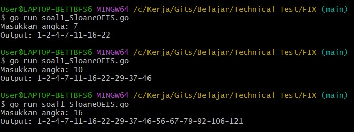
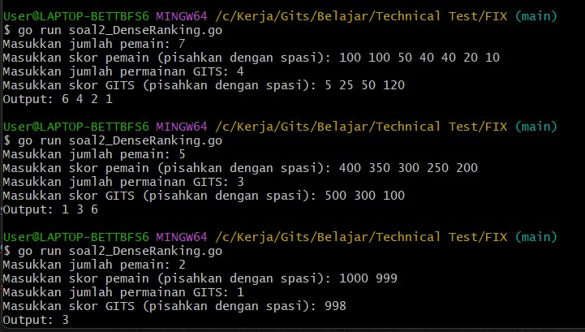
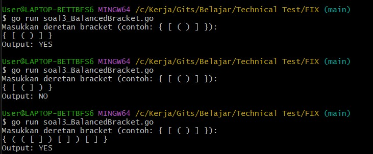

# TechnicalTestGitsBE

## Soal 1 – Deret A000124 (OEIS)
### Screenshot:

---

## Soal 2 – Dense Ranking
### Screenshot:

---

## Soal 3 – Balanced Bracket

### Penjelasan 

### Contoh Input & Output
| Input                     | Output |
|--------------------------|--------|
| `{ [ ( ) ] }`            | YES    |
| `{ [ ( ] ) }`            | NO     |
| `{ ( ( [ ] ) [ ] ) [ ] }`| YES    |

---

## Kompleksitas – Soal 3 (Balanced Bracket)

### Kompleksitas Waktu (_Time Complexity_): `O(n)`

- Setiap karakter pada string input dibaca **satu per satu** menggunakan `for _, char := range s`, sehingga proses ini berjalan **linear** terhadap panjang input (`n`).
- Operasi `append` (push ke stack) dan `pop` (menghapus elemen terakhir) dilakukan maksimal satu kali untuk setiap karakter.
- Tidak ada nested loop, rekursi, atau pemrosesan ulang karakter, sehingga total waktu eksekusi tumbuh secara linear terhadap panjang string.

> **Kesimpulan:** jumlah langkah dalam algoritma sebanding dengan jumlah karakter input → `O(n)`

---

### Kompleksitas Memori (_Space Complexity_): `O(n)`

- Digunakan struktur data **stack** (dalam bentuk slice of rune) untuk menyimpan bracket pembuka.
- Dalam kasus terburuk, semua karakter pada string adalah **bracket pembuka** (`((((`), sehingga semua masuk ke stack.
- Maka jumlah maksimum elemen di stack adalah sebanyak `n` → kompleksitas ruang `O(n)`.

---